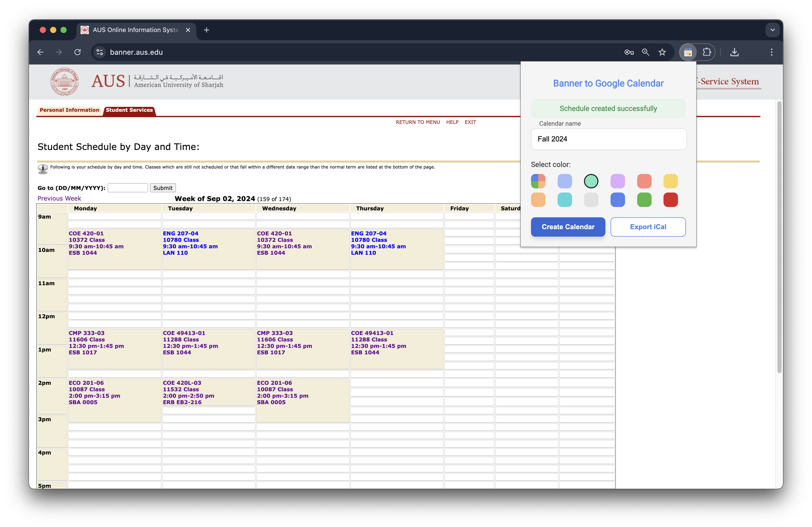
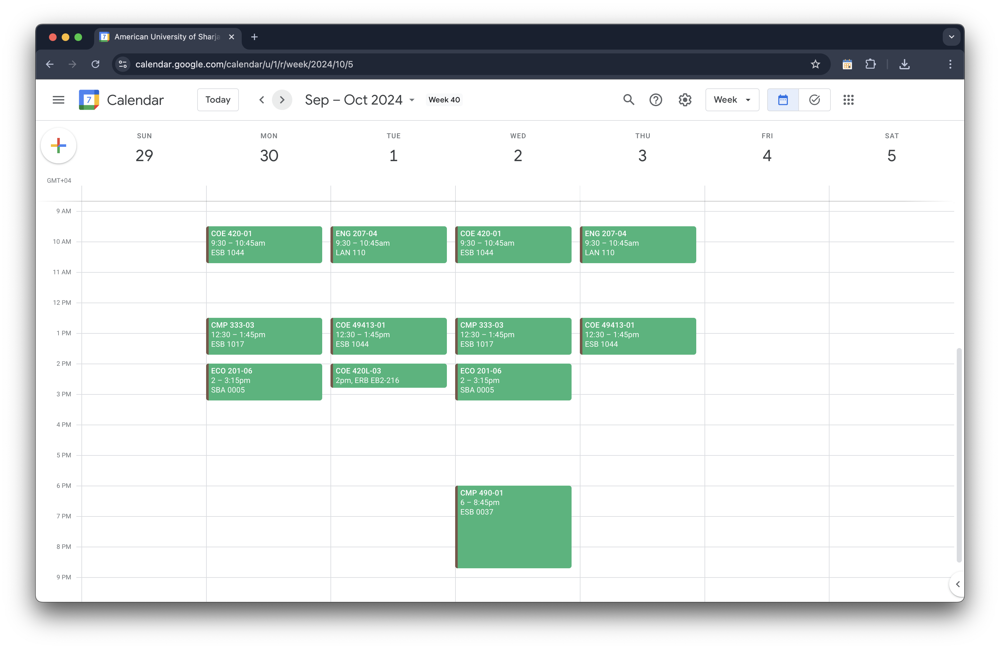

# Banner to Google Calendar

This is a Chrome Extension made to automatically export your AUS schedule from banner.aus.edu to your Google Calendar.

## Usage

To use the extension you need to be under "***Student Schedule by Day and Time***", then click on the extension icon, then name the calendar that will be exported to Google Calendar.

Note: you might have to login in using your Google account when using the program for the first time in order to obtain oauth2 access token since the program uses the Chrome identity API.




## Building the extension from source

Since Manifest V3, Web extensions can't import scripts from CDNs directly into the extension, and hence using a bundler is required for importing external scripts. The only package used in this project is `moment.js` for date/time formatting.

NPM is used in this project and the dependencies are listed under `package.json`. They can be installed using the command:

```console
cd extension/
npm install
```

The bundler used for this project is [parcel](https://github.com/parcel-bundler/parcel). However, any other bundler can be used. The development dependencies can be installed using:

```console
# Under extension directory
npm install --include=dev 
```

The build scripts are already inside `package.json`.

Use the `build` script to bundle the extension with optimization.

Use the `build:test` script to bundle the extension without optimization. This is useful for faster builds when testing and debugging.

```console
# Under extension directory
npm run build
# OR
npm run build:test 
```

By default, the built program will be under `extension/dist/`.

In case of using other bundlers, you have the option of writing the build scripts inside `extension/package.json`:

```json
"scripts": {
  "build": // WRITE BUILD SCRIPT HERE
}
```

and run it using:

```console
# Under extension directory
npm run build
```

## Loading the extension

To load the extension in your browser, type `chrome://extensions/` in the search bar or click on the three dots at the top right corner, then select `Extensions` and `Manage Extensions`. Ensure that developer mode is enabled so that the option `Load unpacked` appears. After that, click `Load unpacked` and choose the directory containing the built extension (should be `extension/dist` by default).
